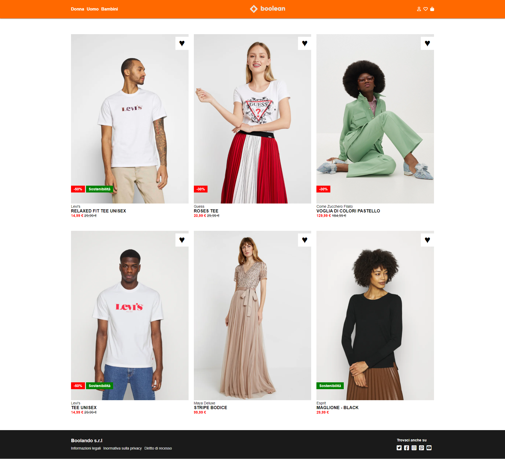

# Boolando

In questo progetto viene riprodotto un e-commerce immaginario basandosi sul layout tipico di Zalando, in particolare gli studenti del corso Boolean dovranno far si che passando sulle immagini dei prodotti cambi la foto presente e potranno così far pratica con le proprietà z-index e position imparate stamani a lezione. 
Di seguito riportiamo le foto della versione di base e di quella con hover del nostro Boolando:

## Versione Base 

## Versione Hover

